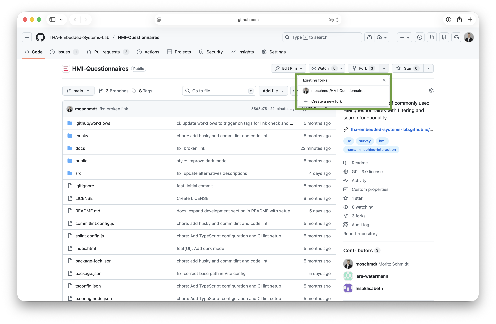
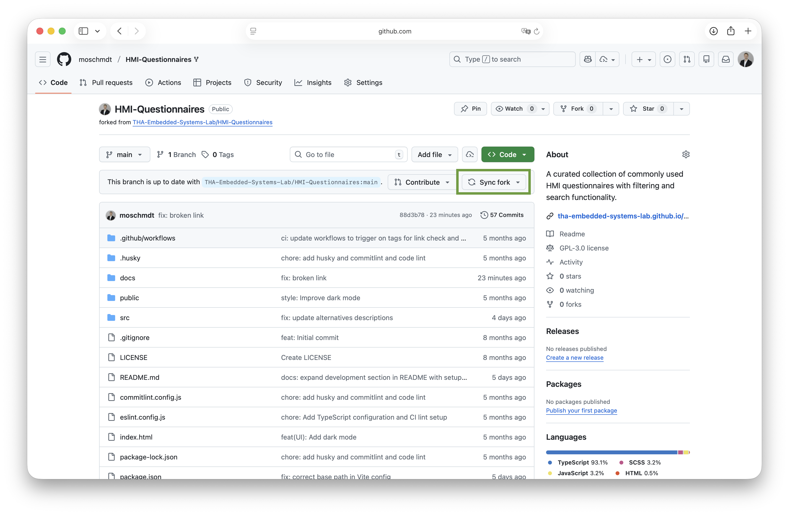
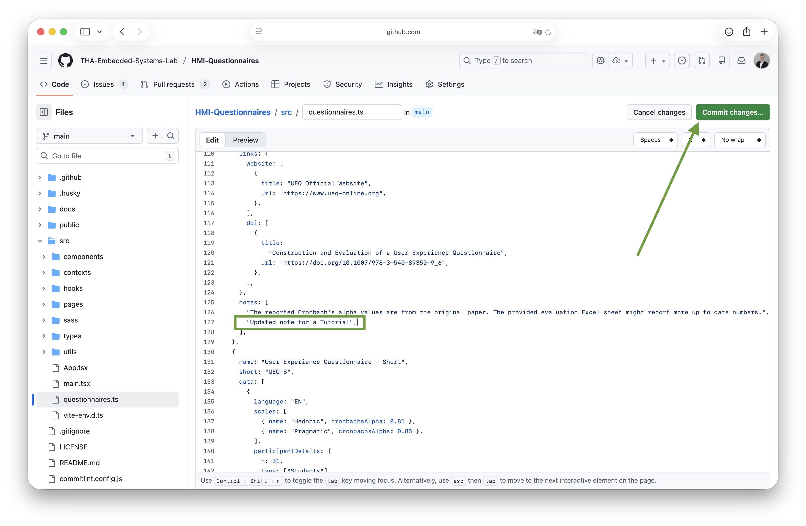
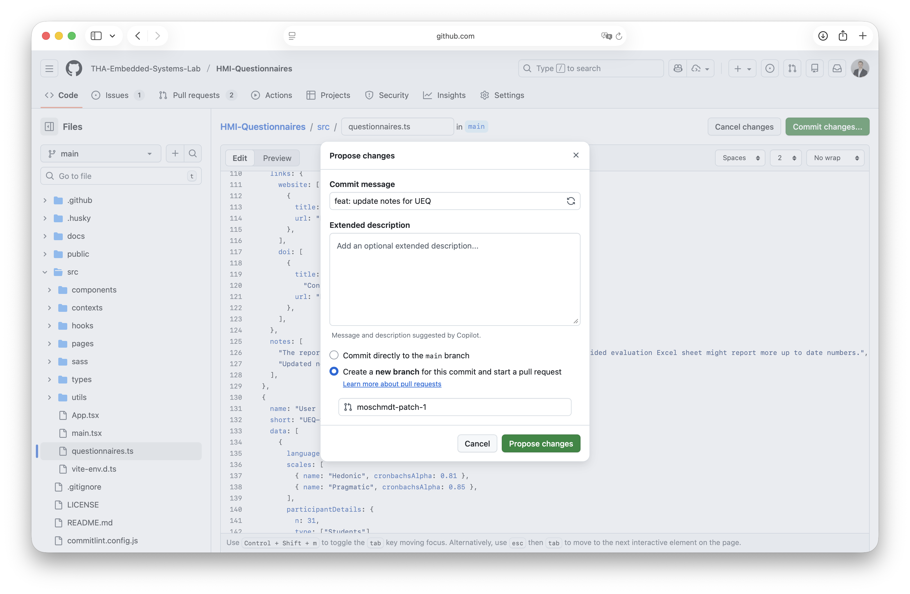
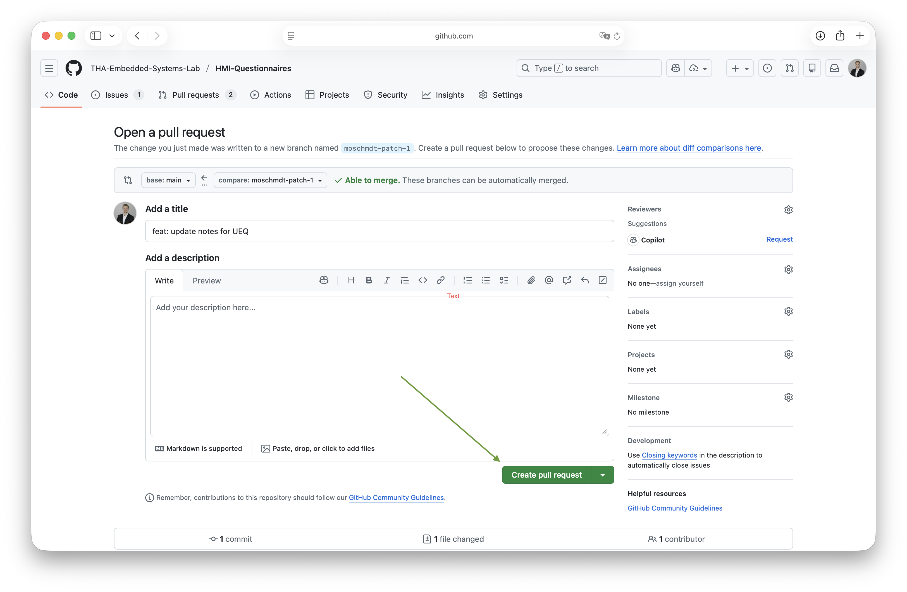
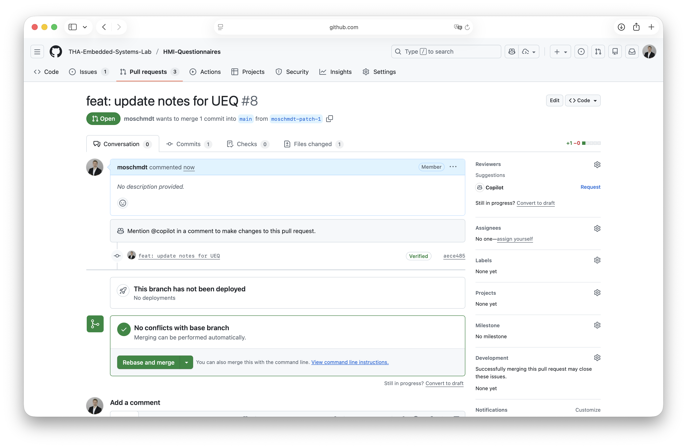

# Contribution Guide

If you are missing a questionnaire in the collection, please check the
[issues](https://github.com/THA-Embedded-Systems-Lab/HMI-Questionnaires/issues)
in case someone already requested it or if there is an ongoing discussion about
it. If not, feel free to open a new issue or directly submit a pull request with
the details of the questionnaire. For PRs please follow the instructions below.

We separate the guide in two use cases: (i) updating existing questionnaire data
and (ii) adding new questionnaires. For both contribution types, you will need
to follow the next steps, before the specific instructions for each use case.

In case you **contributed before**, please **make sure your fork of the
repository is up to date** before starting to work on new changes. The following
images show where to find your fork and how to update it.




1. Go to the [`src/questionnaires.ts`](../src/questionnaires.ts) file in the
   repository.
2. Click the Edit button (pencil icon) at the top right of the file view.
   

3. Locate the questionnaire that needs updating or where you want to add a new
   questionnaire.
   1. **Updating Questionnaire Data**: Make the necessary changes to the
      questionnaire data. Ensure that you follow the existing structure and
      format used in the file. In case the structure is missing some fields,
      please compare to the section below to identify missing fields for the
      complete structure.
   2. **Adding New Questionnaires**: Scroll to the end of the file to add a new
      entry for the questionnaire. Follow the existing structure and format used
      in the file. An example structure/ template is provided below, for copy
      and pasting.

4. Once you have made the changes, commit them with a descriptive message
   explaining the updates you made.

   
   

5. Open a pull request to the main repository, providing a clear description of
   the changes you have made.

   

6. A reviewer will assess your pull request and may provide feedback or request
   changes before merging it into the main repository.

   

7. Wait for a maintainer to review and merge your pull request. Be available for
   questions from the maintainers if they need any clarifications regarding your
   contribution.

## Empty Questionnaires Template

The following code block provides a template to add to the
[`src/questionnaires.ts`](./src/questionnaires.ts) file. For possible values for
the individual fields, please refer to the existing entries in the file, or
check the definitions in [types](./src/types/). You can also refer to the
existing questionnaires as examples.

<!-- markdownlint-disable MD013 -->

```ts
{
  name: "" , // Full name of the questionnaire
  short: "", // Short name or acronym
  data: [
    // This is for the validation data of the questionnaire for specific languages.
    {
      language: "", // 2 character language code, e.g., en
      participantDetails: {
        // Details about the participants on which the questionnaire was validated
        n: 0, // Number of participants
        type: [] // Type of participants, e.g., "students", "employees", etc.
      },
      scales: [
        {
          name:  "",  // Name of the scale/subscale
          cronbachsAlpha: null, // Cronbach's alpha value for the scale, leave null if not available
          omega: { value: 0.00, type: "" } // Omega reliability coefficient with type (e.g., "total", "hierarchical", "McDonald's", remove if not available
        },
        {
          name: "", // Name of the next scale; Copy this block for additional scales
          cronbachsAlpha: null, // ...
          omega: { value: 0.00, type: "" } // Optional: omega reliability coefficient
        }
      ]
    }
  ],
  license: , // License under which the questionnaire is published, leave empty if not available
  metadata: {
    responseFormat: null, // e.g., Likert scale, yes/no, semantic differential, etc., see src/types/ResponseFormat.ts
    time: [], // Relative time to administer the questionnaire to real experiments, e.g. Time.PreStudy, Time.Standalone (without experiment), Time.PostStudy, multiple values possible
    year: null, // Year of publication
    items: null, // Number of items/questions
    languages: [""] // List of available languages in 2 character code, e.g., "en", "de"
  },
  links: { // Types can be "doi", "website", "git", "osf"
    doi: [
      {
        title: "", // Title/description of the DOI link
        url: "" // DOI URL
      }
    ], // Array of DOI links if available; can contain multiple entries
    website: [
      {
        title: "", // Title/description of the website
        url: "" // Website URL
      }
    ],
   },
  domain: [], // Domains of application, e.g., automotive, aviation, general, etc.
  notes: [] // Any additional notes, e.g. average of multiple Cronbach's alpha values for a single scale across multiple groups
}
```

<!-- markdownlint-enable MD013 -->
